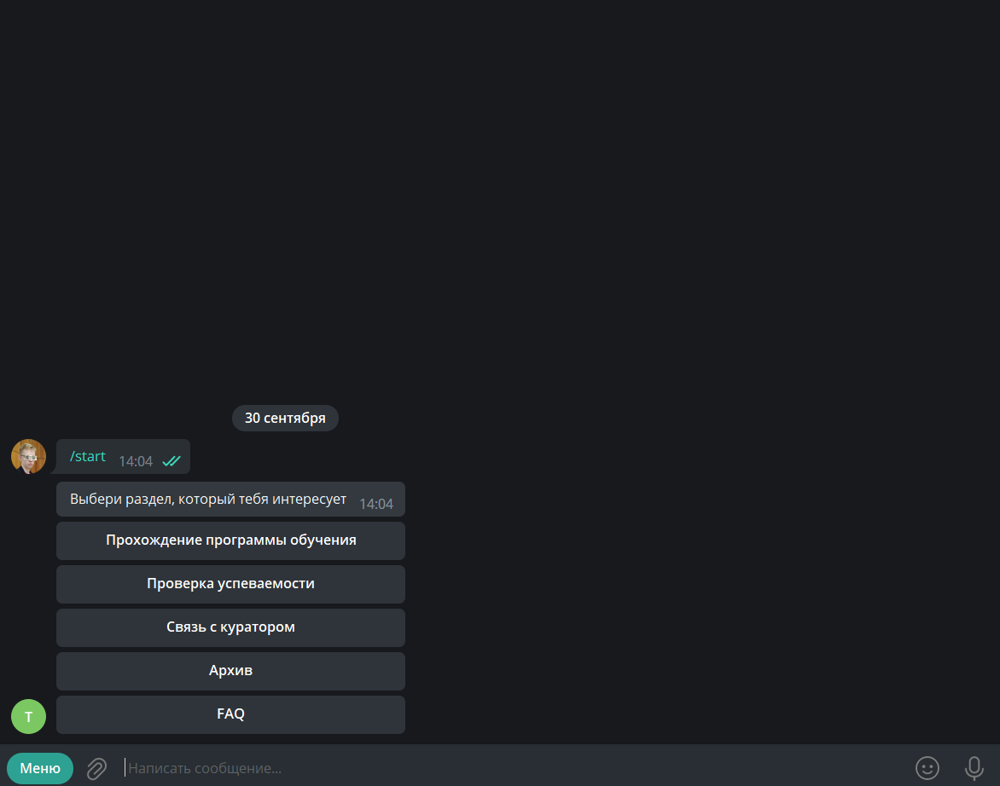
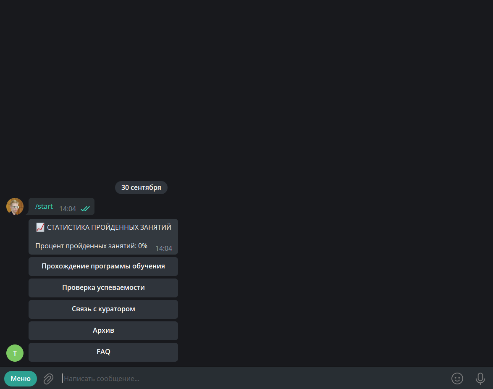
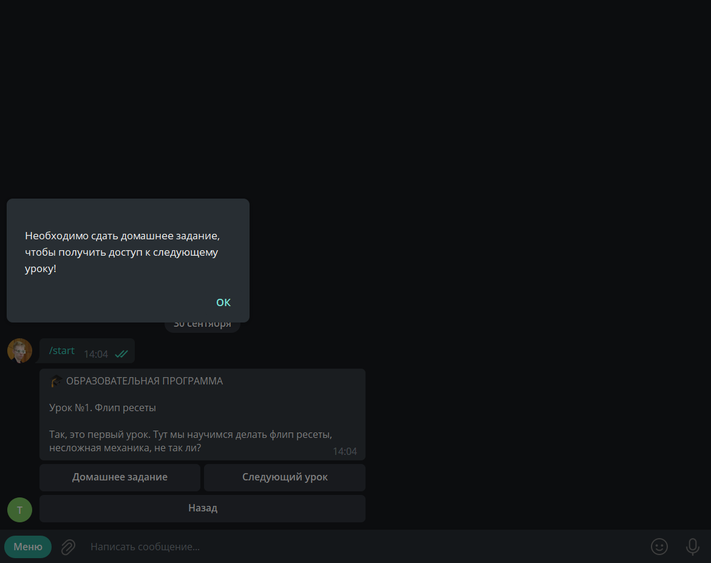
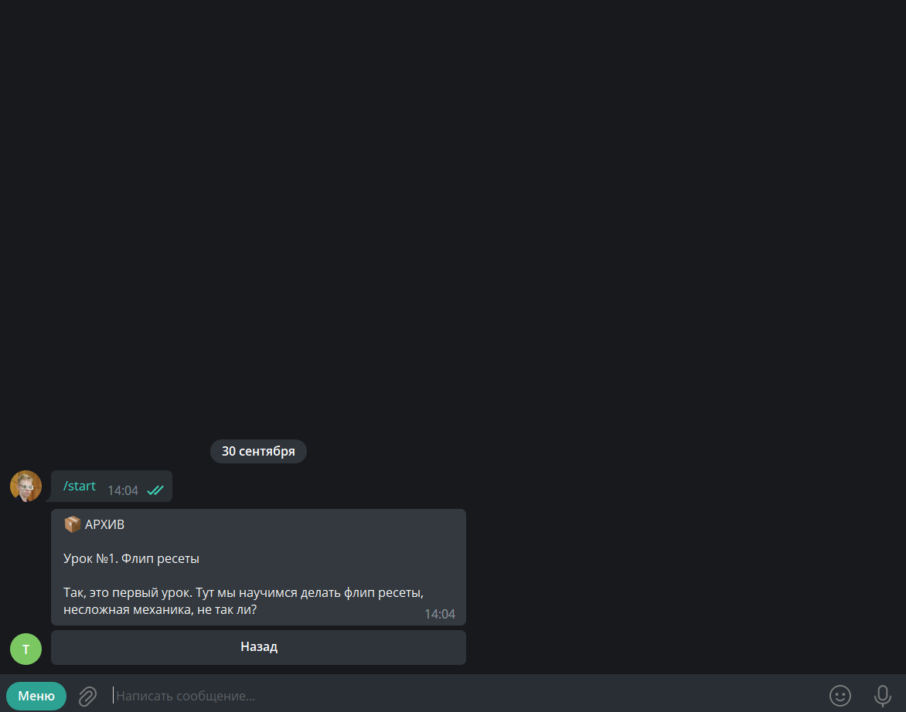

# Project description
Repository contains files of StudyPlatform. 

This is Telegram bot that created for effective teaching of students and their verification by teachers. 
Students can pass homeworks using different type of files and teachers can monitor them, watch statistics, 
write messages to certain students etc.

This project uses Python libraries (version 3.8) such as:
+ aiogram
+ asyncpg
+ asyncio
+ gspread
+ etc

# Demonstration

